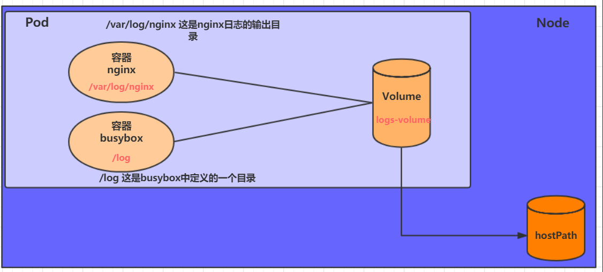
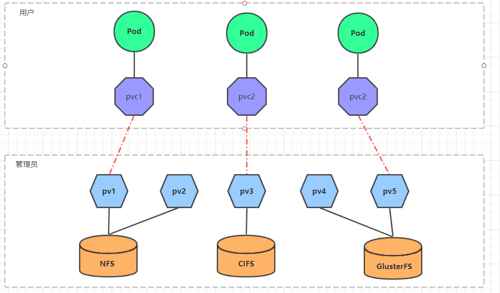
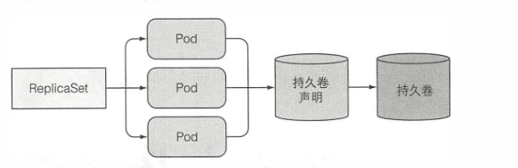
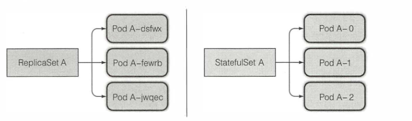

## 常用操作

- 查看所有的pod
- 查看pod在哪台机器

## pod（容器组）

pod是一组并置的容器， 代表了k8s中的基本构建模块。 在实际应用中我们并不会单独部署容器， 更多的是针对一组pod的容器进行部署和操作

### pod的特性

#### pod中可以有一组容器，共享部分资源（namespace）

#### 容器的IP相同，可以通过localhost进行通信

#### pod类似于物理机，pod里的容器类似于物理机上运行的进程

#### pod是k8s扩缩容的基本单位

#### 一般使用时，都是一个pod一个容器。除非两个容器密不可分

### yaml文件示例

```
kubectl get po rizhiyi-splserver -o yaml
```

• metadata 包括名称、命名空间、标签和关于该容器的其他信息 。
• spec 包含 pod 内容的实际说明 ， 例如 pod 的容器、卷和其他数据 。
• status 包含运行中的 pod 的当前信息，例如 pod 所处的条件 、 每个容器的描述和状态，以及内部 IP 和其他基本信息 。

```
apiVersion: v1
kind: Pod
metadata:
  name: kubia
spec:
  containers:
    - image: luksa/kubia
      name: kubia
      ports:
      - containerPort: 8080
        protocol: TCP
```

```shell
kubectl explain pod
kubectl explain pod.kind
```

### 创建pod

```
kubect1 create -f kubia-manual.yaml
```

### 查看pod列表 状态

```
kubectl get po
kubectl get po -o wide
```

### 日志

```
kubectl logs kubia -c kubia
```

### 访问POD

一般来说我们不会直接创建pod，也不会直接访问pod。

```
kubect1 port-forward kubia 8888:8080
```

### 标签

```
metadata:
  name: kubia-manual-v2
  labels:
    creation method: manual
    env: prod
```

```
展示label
kubectl get po --show-labels
label筛选
kubectl get po -1 creation_method=manual

```

### 通过标签约束pod

```
给一个节点加一个label
kubectl label node gke-kubia-85f6-node-Orrx gpu=true
```

```
apiVersion: vl
kind: Pod
metadata:
  name: kubia-gpu
spec:
  nodeSelector.
    gpu: "true"
```

### 命名空间

可以使用namespace命名空间来隔离资源

如果有多个用户使用一个k8s集群，可以每个用户用自己的命名空间

我们的命名空间是rizhiyi

### pod生命周期

和一个个独立的应用容器一样，Pod 也被认为是相对临时性（而不是长期存在）的实体。 Pod 会被创建、赋予一个唯一的 ID（[UID](https://kubernetes.io/zh-cn/docs/concepts/overview/working-with-objects/names/#uids)）， 并被调度到节点，并在终止（根据重启策略）或删除之前一直运行在该节点。

如果一个[节点](https://kubernetes.io/zh-cn/docs/concepts/architecture/nodes/)死掉了，调度到该节点 的 Pod 也被计划在给定超时期限结束后[删除](https://kubernetes.io/zh-cn/docs/concepts/workloads/pods/pod-lifecycle/#pod-garbage-collection)。

Pod 自身不具有自愈能力。如果 Pod 被调度到某[节点](https://kubernetes.io/zh-cn/docs/concepts/architecture/nodes/) 而该节点之后失效，Pod 会被删除；类似地，Pod 无法在因节点资源 耗尽或者节点维护而被驱逐期间继续存活。Kubernetes 使用一种高级抽象 来管理这些相对而言可随时丢弃的 Pod 实例，称作 [控制器](https://kubernetes.io/zh-cn/docs/concepts/architecture/controller/)。

任何给定的 Pod （由 UID 定义）从不会被“重新调度（rescheduled）”到不同的节点； 相反，这一 Pod 可以被一个新的、几乎完全相同的 Pod 替换掉。 如果需要，新 Pod 的名字可以不变，但是其 UID 会不同。

如果某物声称其生命期与某 Pod 相同，例如存储[卷](https://kubernetes.io/zh-cn/docs/concepts/storage/volumes/)， 这就意味着该对象在此 Pod （UID 亦相同）存在期间也一直存在。 如果 Pod 因为任何原因被删除，甚至某完全相同的替代 Pod 被创建时， 这个相关的对象（例如这里的卷）也会被删除并重建。

### 删除pod

```
kubectl delete po rizhiyi-splserver0
```

删除其他类型的资源，命令基本一致

### 存活探针

livenessProbe

```
  spec:
    containers:
      livenessProbe:
        httpGet:
          path: /ping
          port: splserver-port
          scheme: HTTP
        initialDelaySeconds: 120
        timeoutSeconds: 5
        periodSeconds: 20
        successThreshold: 1
        failureThreshold: 3
```

pod启动后120s开始检测，失败3次后就会销毁这个pod，重新建一个

### 启动探针

这里担心120s系统还未启动成功，所以让启动探针先运作，启动探针检测系统成功启动后，才会开始存活探针

```
  spec:
    containers:      
      startupProbe:
        httpGet:
          path: /ping
          port: splserver-port
          scheme: HTTP
        initialDelaySeconds: 90
        timeoutSeconds: 1
        periodSeconds: 30
        successThreshold: 1
        failureThreshold: 5
```

这里估计splserver的启动时间为90s，90s时候启动探针开始检测，3s未响应算超时。每隔30s检测一次，5次后算启动失败。

一共是90+30*5=240s

### 就绪探针

这个是k8s是否把pod视为就绪状态，如果未就绪，容器所在 Pod 上报还未就绪的信息，并且不接受通过 Kubernetes Service 的流量。

在这种情况下，k8s既不杀死应用，也不给它发送请求。

在运行过程中也可能会出现未就绪状态。例如 full gc

存活探针 **不等待** 就绪性探针成功

```
  spec:
    containers:     
      readinessProbe:
        httpGet:
          path: /ping
          port: splserver-port
          scheme: HTTP
        initialDelaySeconds: 90
        periodSeconds: 5
```

# WOKDLOAD RESOURCE

## ReplicationController

上面在介绍探针的时候有提到，当pod不可用时，k8s会删除这个pod并重建它。但是当节点挂掉的时候，pod就没法重建了。而RC(ReplicationController)可以解决这个问题。

上面是对使用rc而不是pod的一种解释。事实上实践中都是创建 **工作负载资源** 而不是pod

- 确保 一 个 pod (或多个 pod副本）持续运行，方法是在现有 pod 丢失时启动一个新 pod。
- 集群节点发生故障时，它将为故障节点上运行的所有 pod (即受ReplicationController 控制的节点上的那些 pod) 创建替代副本。
- 它能轻松实现 pod的水平伸缩。手动和自动都可以

1 2都是rc自带的属性，3的话手动就是用命令，自动水平的话需要用到HorizontalPodAutoscaler，垂直扩容用Vertical Pod Autoscaler

### 创建

```
apiVersion: vl
kind: Replicationcontroller
metadata:
  name: kubia
spec:
  replicas: 3
  selector:
    app: splserver
  template:
    metadata:
      labels:
        app: splserver
    spec:
      containers:
        - name: splserver
          image:
          ports:
          - containerPort: 8080
```

selector是说rc关注的pod，找匹配的标签

template是创建新pod需要用的模板，这个模板的配置和我们上面配置的pod是差不多的。

## ReplicaSet

与ReplicationController的最大区别是，选择器做了很大升级

因为ReplicaSet生来就是要代替ReplicationController的，所以推荐使用ReplicaSet

```
apiVersion: apps/vlbeta2
apiVersion: vl
kind: Replicationcontroller
metadata:
  name: splserver
spec:
  replicas: 3
  selector:
    matchLabels:
      app: splserver
  template:
    metadata:
      labels:
        app: splserver
    spec:
      containers:
        - name: splserver
          image:
          ports:
          - containerPort: 8080
```

```
  selector:
    matchExpressions:
      - key: app
        operator: In
        values:
          - kubia
```

• In : Label的值 必须与其中 一个指定的values 匹配。
• Notln : Label的值与任何指定的values 不匹配。
• Exists : pod 必须包含一个指定名称的标签（值不重要）。使用此运算符时，
不应指定 values字段。
• DoesNotExist : pod不得包含有指定名称的标签。values属性不得指定

还有一个注意的点是apps/v1

## DaemonSet

如果想让pod在每个节点上都运行

跟replicaSet一样，也支持以下选择器

- `matchLabels`
- `matchExpressions`

也可以使用nodeSelector来指定只运行在部分节点上

```
nodeSelector:
  disk: ssd
```

## job

一般的pod在运行结束，进程退出的时候，它的工作负载资源会重建pod。

如果遇到只需要运行一次的pod，正常结束后不再重建，需要使用job。

异常退出的job可以重新调度，所以比较关键的事是保证job正常退出。

```
spec:
  restartPolicy: OnFailure
  containers:
    - name: main
      image: splserver
```

## Service

前面介绍的repicationController，ReplicaSet, DaemonSet等都是用来管理pod的。

参考上面访问pod时需要做的操作，手动绑定端口

kubectl port-forward kubia 8888:8080

现在介绍一种新的暴露服务的方式，Service

服务是 一种为一组功能相同的 pod 提供单一不变的接入点的资源。当服务存在时，它的 IP 地址和端口不会改变。 客户端通过 IP 地址和端口号建立连接， 这些连接会被路由到提供该服务的任意一个 pod 上。 通过这种方式， 客户端不需要知道每个单独的提供服务的pod 的地址，这样这些 pod 就可以在集群中随时被创建或移除。

```
apiVersion: v1
kind: Service
metadata:
  name: splserver-svc
spec:
  ports:
  - port: 9400
    targetPort： 9400
  selector:
    app: splserver
```

这样的一个service会在9400端口接收请求，并转发到标签是splserver的pod的9400端口

kubectl get svc

可以看到默认给service分配了一个cluster-ip

可以随便进一个pod去访问这个ip试一下

```
kubectl exec kubia-7nogl -- curl -s http://10.111.249.153
```

默认是随机发给某个应用，可以用sessionAffinity属性设置亲和力，让同一个客户端的请求发给同一个pod。这个跟ngnix的差距还是比较大的。

```
apiVersion: vl
kind: Service
spec:
  sessionAffinity: ClientIP
```

### ClusterIp

ClusterIp是默认的Sevice类型，上面的例子就是一个ClusterIp

还可以手动指定一个合法的ClusterIp。

这种服务的限制是 只能在集群内访问。这个限制也很好理解，因为ClusterIp是一个集群内的虚拟IP。

### NodePort

clusterIp是在集群内给service分配了一个虚拟IP，如果想在集群外访问pod，可以用NodePort

这个可以理解为给每个节点都对外开放一个端口，外界可以通过 **节点ip**:**port** 的方式来访问，进而转发到这个节点上的pod。

```
apiVersion: v1
kind: Service
metadata:
  name: splserver-svc
spec:
  type: NodePort
  ports:
  - port: 9400
    targetPort： 9400
  selector:
    app: splserver
```

```
NAME  TYPE      CLUSTER-IP    EXTERNAL-IP   PORT(S)          AGE
ztest NodePort  10.233.14.30  <none>        17632:30502/TCP  2d13h
```

给service分了一个cluster-ip，external-ip是none

<!--如果外部的 IP 路由到集群中一个或多个 Node 上，Kubernetes Service 会被暴露给这些 `externalIPs`。 通过外部 IP（作为目的 IP 地址）进入到集群，打到 Service 的端口上的流量， 将会被路由到 Service 的 Endpoint 上。 `externalIPs` 不会被 Kubernetes 管理，它属于集群管理员的职责范畴。-->

NodePort可以不使用ClusterIp这种默认的负载均衡，这意味着我们可以使用自己的负载均衡策略。

### LoadBalancer

一种负载均衡策略，需要依赖云服务。因为没有合适环境暂不介绍。

### Headless

将clusterIp设置为None就是一个无头服务

对于无头 `Services` 并不会分配 Cluster IP，kube-proxy 不会处理它们， 而且平台也不会为它们进行负载均衡和路由。 DNS 如何实现自动配置，依赖于 Service 是否定义了选择算符。

这个需要通过DNS连接

### NodePort


#### 手动定义 endpoint

service是通过一个endpoint资源实现service和pod的连接。

service只能用selector定位集群内的pod，如果service想访问集群外的pod，可以手动定义endpoint。

在服务和pod之间还有一个资源-endpoint，endpoint会暴露服务对应的pod的IP和端口列表

手动创建endpoint，可以将服务重定向到外部pod

## Ingress

- Service的代理在传输层，也就是常说的四层代理。如果外部请求是HTTPS的请求，无法通过Service调度。
- 上面有提到，Service的负载均衡策略是很“弱”的，甚至不能通过cookie绑定客户端。这还是因为Service是四层代理。
- 有的时候我们使用域名暴露服务。当使用传统的反向代理模式暴露服务时，对于每一个Service，都要在Nginx配置一个映射关系。

要解决这些问题，可以用ingress

1. 安装一个ingress controller。这里就不再介绍了
2. 创建ingress资源

查看已安装的ingress controller

```
kubectl get pods --all-namespaces | grep ingress
```

创建ingress

```
apiVersion: extensions/v1beta1
kind: Ingress
metadata:
  name: ingress-http
  namespace: dev
spec:
  rules:
  - host: ztest.com
    http:
      paths:
      - path: /
        backend:
          serviceName: ztest
          servicePort: 17632
  - host: ztest.com
    http:
      paths:
      - path: /web
        backend:
          serviceName: rizhiyi-service-yottaweb
          servicePort: 8090
```

访问要通过ingress-controller的service对应的端口进行访问

```
kubectl get svc --all-namespaces | grep ingress
```

# 卷

由于pod中的容器的文件系统是独立的，当pod异常停止时，k8s会重建一个pod，之前在容器中对文件的修改都会丢失，所以需要一种手段可以持久化数据。

卷的生命周期不与pod中单个容器的生命周期相关。这就意味着有不同类型的卷，有些卷生命周期与pod有关，有些无关。

k8s的卷是pod的组成部分，定义在pod的规范中。

## EmptyDir

EmptyDir的生命周期和pod生命周期相关

一个EmptyDir就是host上的一个空目录。当pod销毁时，EmptyDir中的数据也会永久删除

- 作为临时空间
- 多容器共享目录。一个容器需要从另一个容器中获取数据的目录

例如下面一个测试案例，两个容器在一个pod里

```
apiVersion: v1
kind: Pod
metadata:
  name: volume-emptydir
  namespace: rizhiyi
spec:
  containers:
  - name: nginx
    image: nginx:1.17.1
    ports:
    - containerPort: 80
    volumeMounts:  # 将logs-volume挂在到nginx容器中，对应的目录为 /var/log/nginx
    - name: logs-volume
      mountPath: /var/log/nginx
  - name: busybox8i9
    image: busybox:1.30
    command: ["/bin/sh","-c","tail -f /logs/access.log"] # 初始命令，动态读取指定文件中内容
    volumeMounts:  # 将logs-volume 挂在到busybox容器中，对应的目录为 /logs
    - name: logs-volume
      mountPath: /logs
  volumes: # 声明volume， name为logs-volume，类型为emptyDir
  - name: logs-volume
    emptyDir: {}
```


ngnix容器会将数据写入/var/log/nginx目录，这个目录挂载到volume里。

busybox容器将/logs挂载到volume，此后，busybox容器访问/logs，就相当于访问Nginx下面的/var/log/nginx目录。

访问Nginx

```
curl 10.233.96.211
```

查看busybox容器输出的日志

```
kubectl logs volume-emptydir -c busybox
```

## HostPath

由于EmptyDir会随着pod销毁而销毁，想要持久化数据，可以用HostPath



```
apiVersion: v1
kind: Pod
metadata:
  name: volume-hostpath
  namespace: dev
spec:
  containers:
  - name: nginx
    image: nginx:1.17.1
    ports:
    - containerPort: 80
    volumeMounts:
    - name: logs-volume
      mountPath: /var/log/nginx
  - name: busybox
    image: busybox:1.30
    command: ["/bin/sh","-c","tail -f /logs/access.log"]
    volumeMounts:
    - name: logs-volume
      mountPath: /logs
  volumes:
  - name: logs-volume
    hostPath: 
      path: /root/logs
      type: DirectoryOrCreate  # 目录存在就使用，不存在就先创建后使用
```

这里的logs-volume是随着pod一起创建的，pod建在哪个节点也就意味着卷会挂载到哪个节点上。

但是一旦Node节点故障了，Pod如果转移到了别的节点，老数据就无法读取了

应用场景：

但是某些系统级别的 pod( 通常由 DaemonSet 管理），确实需要读取节点的文件或使用节点文件系统来访问节点设备

## NFS

NFS是一个网络文件存储系统，可以搭建一台NFS服务器，然后将Pod中的存储直接连接到NFS系统上，这样的话，无论Pod在节点上怎么转移，只要Node跟NFS的对接没问题，数据就可以成功访问。

```
apiVersion: v1
kind: Pod
metadata:
  name: volume-nfs
  namespace: dev
spec:
  containers:
  - name: nginx
    image: nginx:1.17.1
    ports:
    - containerPort: 80
    volumeMounts:
    - name: logs-volume
      mountPath: /var/log/nginx
  - name: busybox
    image: busybox:1.30
    command: ["/bin/sh","-c","tail -f /logs/access.log"] 
    volumeMounts:
    - name: logs-volume
      mountPath: /logs
  volumes:
  - name: logs-volume
    nfs:
      server: 192.168.5.6  #nfs服务器地址
      path: /root/data/nfs #共享文件路径
```

1）首先要准备nfs的服务器

```shell
# 在nfs上安装nfs服务
[root@nfs ~]# yum install nfs-utils -y

# 准备一个共享目录
[root@nfs ~]# mkdir /root/data/nfs -pv

# 将共享目录以读写权限暴露给192.168.5.0/24网段中的所有主机
[root@nfs ~]# vim /etc/exports
[root@nfs ~]# more /etc/exports
/root/data/nfs     192.168.5.0/24(rw,no_root_squash)

# 启动nfs服务
[root@nfs ~]# systemctl restart nfs
```

2）接下来，要在的每个node节点上都安装下nfs，这样的目的是为了node节点可以驱动nfs设备

```shell
# 在node上安装nfs服务，注意不需要启动
[root@k8s-master01 ~]# yum install nfs-utils -y
```

## PV和PVC

上面提到的NFS对开发人员来说是比较复杂的，诸如此类的持久卷类型，繁琐程度都差不多。

要创建支持 NFS 协议的卷， 开发人员必须知道 NFS 节点所在的实际服务器。 这违背了 Kubernetes 的基本理念。

所以就有了以下结构，PersistenceVolume和PersistenceVolumeClaim分开。开发人员只需要配置PVC，而PV由运维人员来准备。



如图所示，开发在创建pod时，通过PVC指定存储的类型、容量等，k8s会自动分配符合条件的PV给pod。

### 1. 测试环境可以用OpenEBS 创建 LocalPV 存储类型

https://v2-1.docs.kubesphere.io/docs/zh-CN/appendix/install-openebs/

### 2. 使用pvc来申请pv

```yaml
kind: StatefulSet
apiVersion: apps/v1
metadata:
  name: rizhiyi-splserver
  namespace: rizhiyi
spec:
  replicas: 1
  selector:
    matchLabels:
      app: rizhiyi-splserver
  template:
    metadata:
      creationTimestamp: null
      labels:
        app: rizhiyi-splserver
        rizhiyi_module: splserver
    spec:
      volumes:
        - name: splserver-config
          configMap:
            name: rizhiyi-splserver-config
            defaultMode: 420
      containers:
        …………………………
          volumeMounts:
            - name: splserver-data
              mountPath: /data/rizhiyi/spldata
            - name: splserver-log
              mountPath: /data/rizhiyi/logs/splserver
            - name: splserver-config
              mountPath: /data/rizhiyi/config
        …………………………
  volumeClaimTemplates:
    - kind: PersistentVolumeClaim
      apiVersion: v1
      metadata:
        name: splserver-data
        creationTimestamp: null
      spec:
        accessModes:
          - ReadWriteOnce
        resources:
          requests:
            storage: 5Gi
        storageClassName: openebs-hostpath
        volumeMode: Filesystem
      status:
        phase: Pending
    - kind: PersistentVolumeClaim
      apiVersion: v1
      metadata:
        name: splserver-log
        creationTimestamp: null
      spec:
        accessModes:
          - ReadWriteOnce
        resources:
          requests:
            storage: 5Gi
        storageClassName: openebs-hostpath
        volumeMode: Filesystem
      status:
        phase: Pending
  serviceName: rizhiyi-service-splserver
  podManagementPolicy: OrderedReady
  updateStrategy:
    type: RollingUpdate
    rollingUpdate:
      partition: 0
  revisionHistoryLimit: 10
```

### 3. 配置

关键配置参数说明：

- **访问模式（accessModes）**

  用于描述用户应用对存储资源的访问权限，访问权限包括下面几种方式：

    - ReadWriteOnce（RWO）：读写权限，但是只能被单个节点挂载。 ReadWriteOnce 访问模式也允许运行在同一节点上的多个 Pod 访问卷。
    - ReadOnlyMany（ROX）： 只读权限，可以被多个节点挂载
    - ReadWriteMany（RWX）：读写权限，可以被多个节点挂载

  `需要注意的是，底层不同的存储类型可能支持的访问模式不同`

- **存储类别**

  PV可以通过storageClassName参数指定一个存储类别

    - 具有特定类别的PV只能与请求了该类别的PVC进行绑定
    - 未设定类别的PV则只能与不请求任何类别的PVC进行绑定

- **资源**

  参考https://github.com/kubernetes/design-proposals-archive/blob/main/scheduling/resources.md

- **volumeMode**

在pv中，volumeModes分为两种：`Filesystem（文件系统）` 和 `Block（块）`。 `volumeMode` 是一个可选的 API 参数。 如果该参数被省略，默认的卷模式是 `Filesystem`。

`volumeMode` 属性设置为 `Filesystem` 的卷会被 Pod *挂载（Mount）* 到某个目录。 如果卷的存储来自某块设备而该设备目前为空，Kuberneretes 会在第一次挂载卷之前 在设备上创建文件系统。

你可以将 `volumeMode` 设置为 `Block`，以便将卷作为原始块设备来使用。 这类卷以块设备的方式交给 Pod 使用，其上没有任何文件系统。 这种模式对于为 Pod 提供一种使用最快可能方式来访问卷而言很有帮助，Pod 和 卷之间不存在文件系统层。另外，Pod 中运行的应用必须知道如何处理原始块设备。 关于如何在 Pod 中使用 `volumeMode: Block` 的卷，可参阅 [原始块卷支持](https://kubernetes.io/zh-cn/docs/concepts/storage/persistent-volumes/#raw-block-volume-support)。

如果用户通过 PersistentVolumeClaim 规约的 `volumeMode` 字段来表明对原始 块设备的请求，绑定规则与之前版本中未在规约中考虑此模式的实现略有不同。 下面列举的表格是用户和管理员可以为请求原始块设备所作设置的组合。 此表格表明在不同的组合下卷是否会被绑定。

静态供应卷的卷绑定矩阵：

| PV volumeMode | PVC volumeMode | Result |
| ------------- | :------------: | -----: |
| 未指定        |     未指定     |   绑定 |
| 未指定        |     Block      | 不绑定 |
| 未指定        |   Filesystem   |   绑定 |
| Block         |     未指定     | 不绑定 |
| Block         |     Block      |   绑定 |
| Block         |   Filesystem   | 不绑定 |
| Filesystem    |   Filesystem   |   绑定 |
| Filesystem    |     Block      | 不绑定 |
| Filesystem    |     未指定     |   绑定 |

我们的pod布局不具备识别原始块的能力，因此手动指定为volumeMode

# 配置ConfigMap

## 基础回顾

在使用docker时，一般传参我们会用环境变量的方式；或者在DockerFile构建的时候就把配置写入；或者挂载卷。

### 覆盖容器参数

Dockerfile中的两种指令分别定义命令与参数这两个部分：
• ENTRYPOINT定义容器启动时被调用的可执行程序。
• CMD指定传递给ENTRYPOINT的参数。

一般都是用ENTRYPOINT，这样在run的时候，使用arg来覆盖CMD定义的默认参数

```
docker run splserver arg1 arg2
```

上述两条指令均支持以下两种形式：
• shell形式一如ENTRYPOINT node app.js。
• exec形式一如ENTRYPOINT ["node", "app. j s"]。

区别是exec模式的主进程就是node，而shell模式的主进程是shell进程。

在k8s中覆盖启动参数

```
kind: Pod
spec:
  containers:
  - image: some/image
    command: ["/bin/ command" l
    args: ["argl", "arg2", "arg3"]
```

### 指定环境变量

```
kind: Pod
spec:
  containers:
  - image: luksa/fortune:env
    env:
    - name: INTERVAL
      value: "30"
    name: html-generator
```

### 引用环境变量

```
    env:
    - name: INTERVAL
      value: "30"
    - name: "$(INTERVAL)bar"
    name: html-generator
```

## ConfigMap解耦

### 字面量创建cm

```
kubectl create configmap fortune-config -- from-literal=sleep-interval=25 --from-literal=bar=baz
```

### 文件创建cm

```
#默认的键名是config-file
kubectl create configmap my-config --from-file=config-file.conf
#指定键名为key
kubectl create configmap my-config --from-file=key=config-file.conf
#文件夹
kubectl create configmap my-config --from-file=/path/to/dir
```

### 使用cm

#### 通过环境变量

```
apiVersion: v1
kind: Pod
metadata:
  name:
  fortune-env-from-configmap
spec:
  containers:
  - image: luksa/fortune:enV
    name: INTERVAL
    env:
    - name: INTERVAL
      valueFrom :
        configMapKeyRef
          name: 
          key: sleep-interval
```

#### 使用环境变量，传递全部ConfigMap

```
apiVersion: v1
kind: Pod
metadata:
  name:
  fortune-env-from-configmap
spec:
  containers:
  - image: luksa/fortune:enV
    name: INTERVAL
    envFrom:
    - prefix: INTERVAL_
      configMapKeyRef
        name: my-config-map
```

#### 当配置项很多时，使用ConfigMap卷

1. 先初始化/更新ConfigMap卷

   ```
   kubectl create configmap rizhiyi-splserver-config --from-file=./splserver_config.zip --namespace=rizhiyi
   ```


2. 创建/更新POD

```
    spec:
      volumes:
        - name: splserver-config
          configMap:
            name: rizhiyi-splserver-config
            defaultMode: 420
      containers:
        -name: rizhiyi-splserver
        …………#省略
        volumeMounts:
        - name: splserver-config
          mountPath: /data/rizhiyi/config
```

# Deployment

## 更新pod内的应用程序

1. 先删除旧版本，再使用新版本pod替换。

   修改pod模板，手动删除旧的pod，ReplicaSet会重新创建基于新模板的pod，这样会导致短暂的服务不可用。

2. 先创建新pod，再删除旧版本pod。

   在使用ReplicaSet+Service的模式下，可以先创建新版本的pod,标签修改为pod:v2。等新的pod启动完成后，修改Service的pod选择器，这样就可以快速切换到新版本。

   又叫蓝绿部署

   这种模式的缺点是需要双倍的硬件要求。比如splserver需要16G的内存，部署两个就是32G。

3. 滚动升级

   滚动升级的过程是先启动1个新pod，然后停止一个旧pod，切换到新pod。重复直到全部pod都替换为新的。这个需求貌似很难实现，好在k8s有Deployment可以滚动升级

## 使用Deployment滚动更新

### 1.创建Deployment

```
apiVersion: apps/v1
kind: Deployment
metadata:
  name: ztest-deploy-nginx
spec:
  selector:
    matchLabels:
      app: ztest-deploy
  template:
    metadata:
      labels:
        app: ztest-deploy
    spec:
      containers:
        - image: nginx:1.22.0
          name: ztest-nginx
```

### 2.在线更新replicas为3

```
kubectl scale deployment ztest-deploy-nginx --replicas 3
```

### 3.查看replicas的变化,同时修改deployment的镜像版本为nginx:1.23.0

```
kubectl get pod -n rizhiyi -w|grep ztest-deploy
#或者用 以下命令观察deployment的变化
kubectl rollout status deployment ztest-deploy-nginx
```

```
kubectl edit deployment ztest-deploy-nginx
```

```
ztest-deploy-nginx-577cd64cf6-72nq7       1/1     Running     0          9m38s
ztest-deploy-nginx-577cd64cf6-7sxx9       1/1     Running     0          7m31s
ztest-deploy-nginx-577cd64cf6-nw9cm       1/1     Running     0          7m31s
ztest-deploy-nginx-65cfbc878c-5h7gt       0/1     Pending     0          0s
ztest-deploy-nginx-65cfbc878c-5h7gt       0/1     Pending     0          0s
ztest-deploy-nginx-65cfbc878c-5h7gt       0/1     ContainerCreating   0          0s
ztest-deploy-nginx-65cfbc878c-5h7gt       0/1     ContainerCreating   0          1s
ztest-deploy-nginx-65cfbc878c-5h7gt       0/1     ErrImagePull        0          8s
ztest-deploy-nginx-65cfbc878c-5h7gt       0/1     ImagePullBackOff    0          23s
ztest-deploy-nginx-65cfbc878c-5h7gt       0/1     ErrImagePull        0          42s
ztest-deploy-nginx-65cfbc878c-5h7gt       0/1     ImagePullBackOff    0          54s
ztest-deploy-nginx-65cfbc878c-5h7gt       0/1     Terminating         0          68s
ztest-deploy-nginx-5d58c9cf55-tgbj7       0/1     Pending             0          0s
ztest-deploy-nginx-5d58c9cf55-tgbj7       0/1     Pending             0          0s
ztest-deploy-nginx-5d58c9cf55-tgbj7       0/1     ContainerCreating   0          0s
ztest-deploy-nginx-5d58c9cf55-tgbj7       0/1     ContainerCreating   0          1s
ztest-deploy-nginx-65cfbc878c-5h7gt       0/1     Terminating         0          69s
ztest-deploy-nginx-65cfbc878c-5h7gt       0/1     Terminating         0          73s
ztest-deploy-nginx-65cfbc878c-5h7gt       0/1     Terminating         0          73s
ztest-deploy-nginx-5d58c9cf55-tgbj7       1/1     Running             0          47s
ztest-deploy-nginx-577cd64cf6-7sxx9       1/1     Terminating         0          10m
ztest-deploy-nginx-5d58c9cf55-mddhp       0/1     Pending             0          0s
ztest-deploy-nginx-5d58c9cf55-mddhp       0/1     Pending             0          0s
ztest-deploy-nginx-5d58c9cf55-mddhp       0/1     ContainerCreating   0          0s
ztest-deploy-nginx-5d58c9cf55-mddhp       0/1     ContainerCreating   0          1s
ztest-deploy-nginx-577cd64cf6-7sxx9       1/1     Terminating         0          10m
ztest-deploy-nginx-5d58c9cf55-mddhp       1/1     Running             0          2s
ztest-deploy-nginx-577cd64cf6-7sxx9       0/1     Terminating         0          10m
ztest-deploy-nginx-577cd64cf6-nw9cm       1/1     Terminating         0          10m
ztest-deploy-nginx-5d58c9cf55-jdktz       0/1     Pending             0          0s
ztest-deploy-nginx-5d58c9cf55-jdktz       0/1     Pending             0          0s
ztest-deploy-nginx-5d58c9cf55-jdktz       0/1     ContainerCreating   0          0s
ztest-deploy-nginx-577cd64cf6-nw9cm       1/1     Terminating         0          10m
ztest-deploy-nginx-5d58c9cf55-jdktz       0/1     ContainerCreating   0          1s
ztest-deploy-nginx-577cd64cf6-nw9cm       0/1     Terminating         0          10m
ztest-deploy-nginx-5d58c9cf55-jdktz       1/1     Running             0          2s
ztest-deploy-nginx-577cd64cf6-72nq7       1/1     Terminating         0          12m
ztest-deploy-nginx-577cd64cf6-72nq7       1/1     Terminating         0          12m
ztest-deploy-nginx-577cd64cf6-72nq7       0/1     Terminating         0          12m
ztest-deploy-nginx-577cd64cf6-nw9cm       0/1     Terminating         0          10m
ztest-deploy-nginx-577cd64cf6-nw9cm       0/1     Terminating         0          10m
ztest-deploy-nginx-577cd64cf6-7sxx9       0/1     Terminating         0          10m
ztest-deploy-nginx-577cd64cf6-7sxx9       0/1     Terminating         0          10m
ztest-deploy-nginx-577cd64cf6-72nq7       0/1     Terminating         0          12m
ztest-deploy-nginx-577cd64cf6-72nq7       0/1     Terminating         0          12m
```


## 关于Deployment

### 1. deployment是用来管理ReplicaSet的

```
kubectl get rs -n rizhiyi
```

可以看到3个rs

```
ztest-deploy-nginx-577cd64cf6       0         0         0       14m
ztest-deploy-nginx-5d58c9cf55       3         3         3       3m29s
ztest-deploy-nginx-65cfbc878c       0         0         0       4m36s
```

对应的pod

```
ztest-deploy-nginx-5d58c9cf55-jdktz       1/1     Running     0          27s
ztest-deploy-nginx-5d58c9cf55-mddhp       1/1     Running     0          29s
ztest-deploy-nginx-5d58c9cf55-tgbj7       1/1     Running     0          76s
```

上面的操作，换了两次版本，所以有了两个历史的rs。可以用这两个rs进行版本回退。

```
kubectl rollout undo deployment kubia
```

```
kubectl rollout undo deployment kubia - -to-revision=l
```

### 2.Deployment还可以不滚动升级


考虑到Deployment可以快速回滚，可以尽可能用Deployment而不是ReplicaSet

## 金丝雀发布（灰度发布）

例如现在有3个pod正在运行，升级之后立即暂停，Deployment会保持旧的3个pod并创建一个新版本pod，这时可以测试一下新版本pod是否可用，可用继续，不可用就回退

```
#修改镜像
kubect1 set image deployment ztest-deploy-nginx ngnix=nginx:1.23
#暂停
kubect1 rollout pause deployment ztest-deploy-nginx
#继续
kubect1 rollout resume deployment ztest-deploy-nginx
#取消
kubectl rollout undo deployment ztest-deploy-nginx
```

# StatefulSet

## 有状态的pod

思考以下问题。

之前在分析PVC时有提到，可以在定义ReplicaSet时，声明PVC以持久化ReplicaSet的数据。



```yaml
apiVersion: vl
kind: ReplicaSet
metadata:
  name: splserver
spec:
  replicas: 3
  selector:
    app: splserver
  template:
    metadata:
      labels:
        app: splserver
    spec:
      containers:
        - name: splserver
          image:
          ports:
          - containerPort: 8080
      volumes:
        - name: splserver-config
          configMap:
            name: rizhiyi-splserver-config
            defaultMode: 420
```

查看上述ReplicaSet，由于ReplicaSet创建的Pod都是基于同一个模板，这些Pod共享同一个PVC。

这是因为ReplicaSet是无状态的，因此k8s不会给ReplicaSet创建的Pod分配独立存储。

如果想每个副本都使用独立的存储，需要用StatefulSet。

## StatefulSet的特性

```yaml
apiVersion: v1
kind: Service
metadata:
  name: nginx
  labels:
    app: nginx
spec:
  ports:
  - port: 80
    name: web
  clusterIP: None
  selector:
    app: nginx
---
apiVersion: apps/v1
kind: StatefulSet
metadata:
  name: web
spec:
  selector:
    matchLabels:
      app: nginx # 必须匹配 .spec.template.metadata.labels
  serviceName: "nginx"
  replicas: 3 # 默认值是 1
  minReadySeconds: 10 # 默认值是 0
  template:
    metadata:
      labels:
        app: nginx # 必须匹配 .spec.selector.matchLabels
    spec:
      terminationGracePeriodSeconds: 10
      containers:
      - name: nginx
        image: k8s.gcr.io/nginx-slim:0.8
        ports:
        - containerPort: 80
          name: web
        volumeMounts:
        - name: www
          mountPath: /usr/share/nginx/html
  volumeClaimTemplates:
  - metadata:
      name: www
    spec:
      accessModes: [ "ReadWriteOnce" ]
      storageClassName: "my-storage-class"
      resources:
        requests:
          storage: 1Gi
```


### 提供稳定的网络标识



可以明显看出，由StatefulSet创建的pod拥有可预知的名字和主机名。

为了做到这点，StatefulSet要求必须搭配一个无头服务，通过无头服务提供网络标识。

上述例子中：

- 名为 `nginx` 的 Headless Service 用来控制网络域名。
- 
